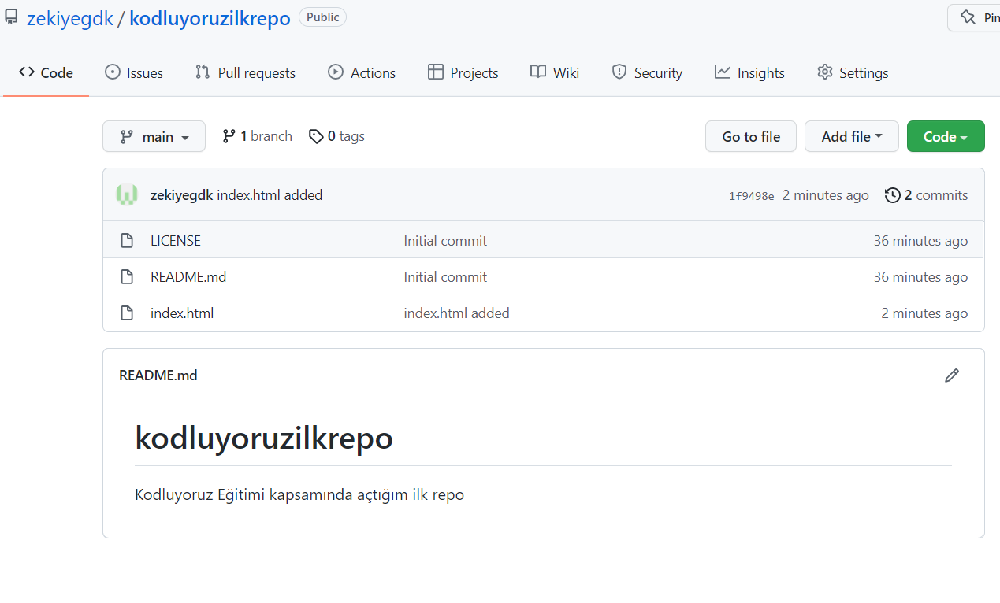

# Kodluyoruz Ilk Repo
[Kodluyoruz](https://www.kodluyoruz.org/) Eğitimi kapsamında açılan ilk repodur. İçerisinde bir adet README dosyası, bir adet de index.html vardır.




## Installation

Öncelikle projeyi clonelayın.

```
git clone https://github.com/zekiyegdk/kodluyoruzilkrepo.git
```

## Usage

Projeyi cloneladıktan sonra Visual Studio Code programında açınız.

Linux için :

```
cd kodluyoruzilkrepo
code .
```

## Contributing

Pull requestler kabul edilir. Büyük değişiklikler için, lütfen önce neyi değiştirmek istediğinizi tartışmak için bir konu açınız.

## License


[MIT](https://choosealicense.com/licenses/mit/)


-------------------------
[Patika](https://choosealicense.com/licenses/mit/) ailesine teşekkürler.


